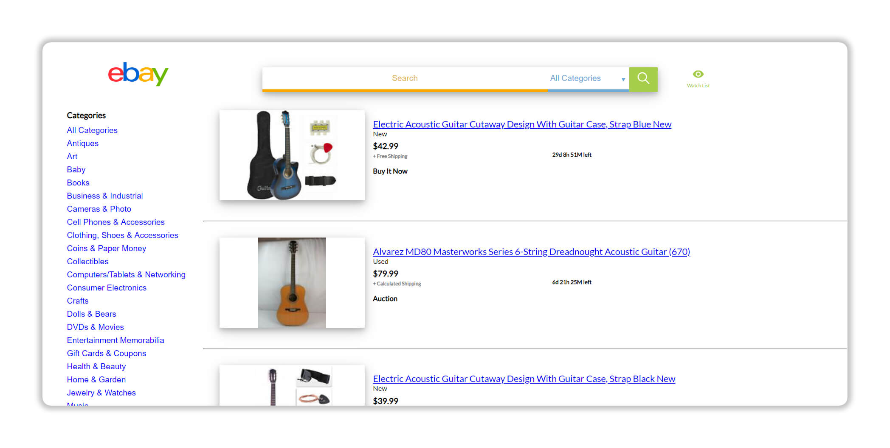
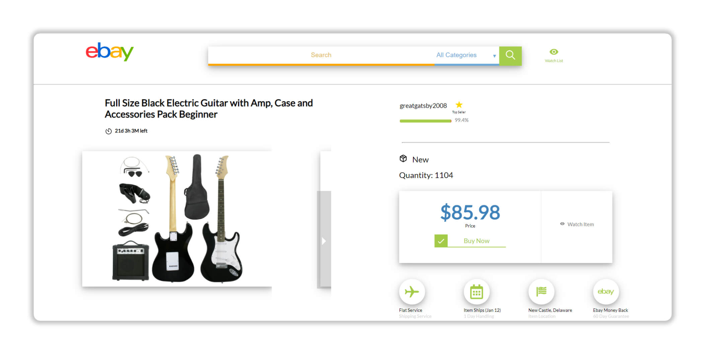
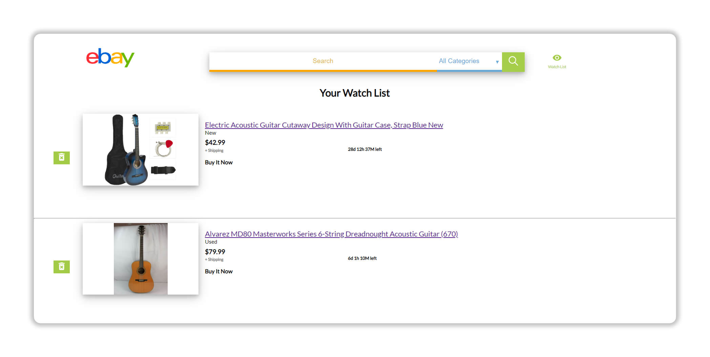

# Ebay Redesign Site
A responsive redesigned website of Ebays utilizing the Ebay API to make fetch calls and retrieve unique item information.



<p align="center">
<a href="https://kz-ebay-redesign.netlify.com/" target="_blank" >

</a>
</p>

## Installation

Clone and run npm install

```bash
git clone https://github.com/kzitouni/Ebay_Site_Redesign.git 
```
```bash
npm install 
```


## Development

| Tech | Use|
| ------ | ------ |
| React| Used on the client-side because its fast, scalable, and simple |
| CSS| Used to style react elements |
| Ebay API | Used to fetch live data from Ebay to display on the site|
| GIT |Version Control|


## Additional Images


